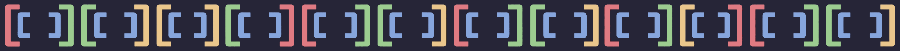
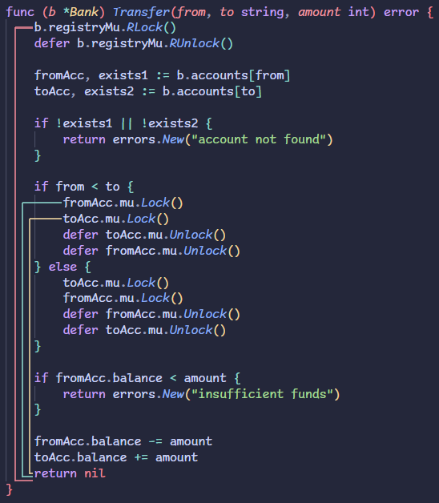

Gomu continuously visualizes the precise lifetime of your Go mutex locks in real-time, helping you eliminate heavy lock contention, resource leaks, and deadlocks before they hit production.

[**Install from the VS Code Marketplace**](https://marketplace.visualstudio.com/items?itemName=coalaura.gomu)



## Why Gomu?

In high-concurrency Go applications, managing lock contention is critical. Holding a `sync.Mutex` or `sync.RWMutex` even a few lines too long can turn a highly parallel program into a sequential bottleneck. 

While `defer mu.Unlock()` is a Go best practice for safety, it extends the lock's lifetime to the very end of the surrounding function. In long or complex functions, this often holds the lock through expensive I/O operations or heavy computations unnecessarily.

**Gomu is different:**
* **Real-Time Visual Scopes:** Instantly draws elegant, rainbow-colored vertical brackets in your editor margin that trace exactly where a lock begins and where it is released.
* **Smart Defer Parsing:** Automatically detects `defer` calls and projects the bracket all the way to the end of the enclosing function scope.
* **Zero Disk I/O:** Analyzes your unsaved VS Code buffers directly in RAM on every keystroke. No temporary files, no waiting on saves.
* **Persistent Daemon Architecture:** Communicates with a highly optimized, persistent Go background daemon via lightning-fast Newline-Delimited JSON (NDJSON) over standard I/O streams for lag-free performance.
* **Zero Setup:** The extension bundles cross-compiled binaries for Windows, macOS, and Linux. No Go toolchain configurations required.

## Features & Capabilities

* **Rainbow-Style Highlighting:** Automatically color-codes overlapping, nested, or multiple distinct locks using VS Code's bracket pair colors.
* **Granular Lock Type Tracking:** Accurately distinguishes and pairs write locks (`Lock` / `Unlock`) and read locks (`RLock` / `RUnlock`).
* **Complex Receiver Resolution:** Correctly tracks lock scopes across local variables, package-level variables, struct fields, pointer dereferences, and slices (e.g., `mu`, `state.mu`, `locks[i]`).
* **Aesthetic Customization:** Fully customize the visual appearance of the scope lines to match your favorite coding font and theme thickness.

## Configuration

You can configure Gomu via your VS Code `settings.json` (also available via the settings UI under **Extensions -> Gomu**).

```json
{
  "gomu.lineOpacity": 75,
  "gomu.lineWidth": 2,
  "gomu.lineSpacing": 6,
  "gomu.baseOffset": 6
}
```

* `gomu.lineOpacity`: Opacity of the scope lines, from `0` (fully transparent) to `100` (fully opaque). *(Default: `75`)*
* `gomu.lineWidth`: Thickness of the scope lines in pixels. *(Default: `2`)*
* `gomu.lineSpacing`: Horizontal clear space between nested scope lines in pixels. *(Default: `6`)*
* `gomu.baseOffset`: Horizontal distance in pixels between the code text and the outermost scope line (the length of the bracket's foot). *(Default: `6`)*